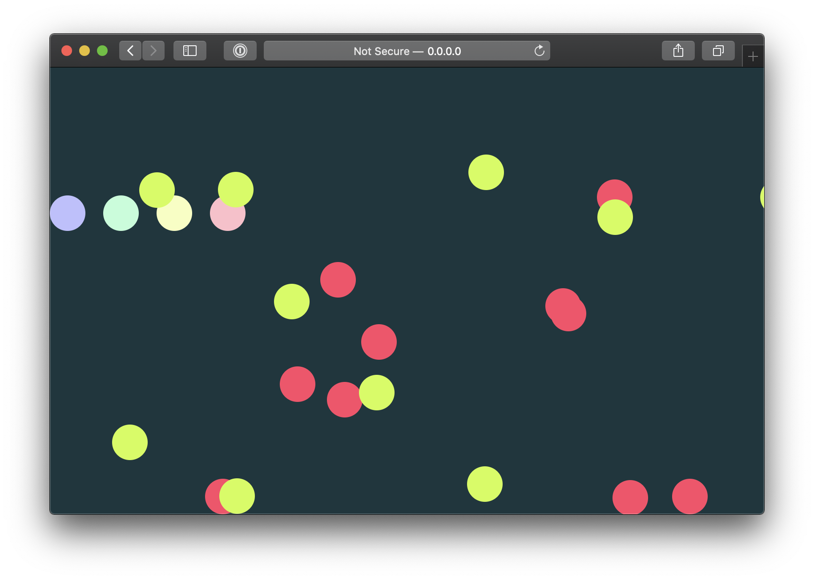

# ECS code examples



Code examples for the talk on ECS with [ECSY](https://ecsy.io/).

For the slides check: [slides.com/pirelenito/games-web-ecsy](https://slides.com/pirelenito/games-web-ecsy/fullscreen).

## Running

To run the examples you will need [Node.js](https://nodejs.org/en/) and [Yarn](https://yarnpkg.com/).

Then in the project folder, install its dependencies:

```
yarn
```

And start the development server with:

```
yarn dev
```

There are a couple of examples:

- `first-example/index.html`: shows a simple rendering loop
- `game-loop/index.html`: shows an interactive game loop with "physics"
- `ecs/index.html`: shows the previous game loop example converted to ECS
- `ecs/complete.html`: shows a more elaborate example (multiplayer, more entities)
- `ecs/three.html`: the complete example from before but in 3D

## Tools

Built with:

- [ECSY](https://ecsy.io/)
- [Parcel](https://parceljs.org/)
- [three.js](https://threejs.org/)
